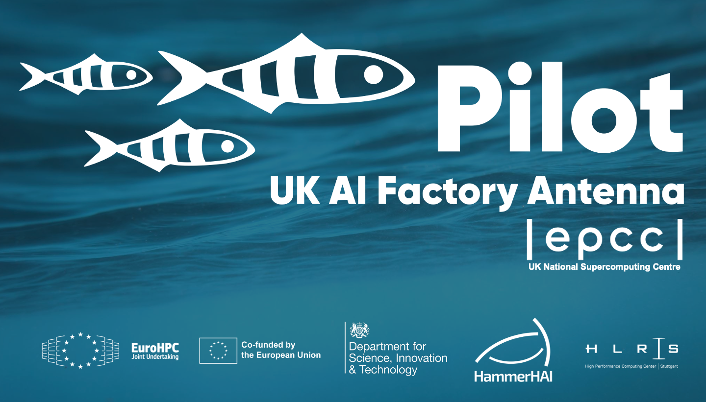

# 2026-08-21-Demystifying-AI
This repository contains materials for the Pilot-UKAIFA in-person course, Demystifying AI
Edinburgh, Friday 21st August, 2026

## Course Materials

## Course Timetable

```
09:30 Welcome & Course Overview
09:40 What is AI? / Introduction to Machine Learning - Part 1
10:30 Break
10:45 Introduction to Machine Learning - Part 2
11:35 Introduction to Neural Networks
12:30 Lunch
13:30 Discussion: Ethical Considerations in AI
14:00 What happens when you enter a prompt into an AI assistant?
15:00 Break
15:15 Writing good prompts
15:30 Beyond the Prompt: Introduction to AI-assisted coding and Agentic AI
16:20 Wrap-Up
16:30 Close
```


This course was created by Adam Carter, EPCC, The University of Edinburgh as part of the Pilot-UKAIFA project




Unless otherwise stated, materials in this repository are &copy; 2026 The University of Edinburgh and may be reused under the terms of CC BY 4.0.
